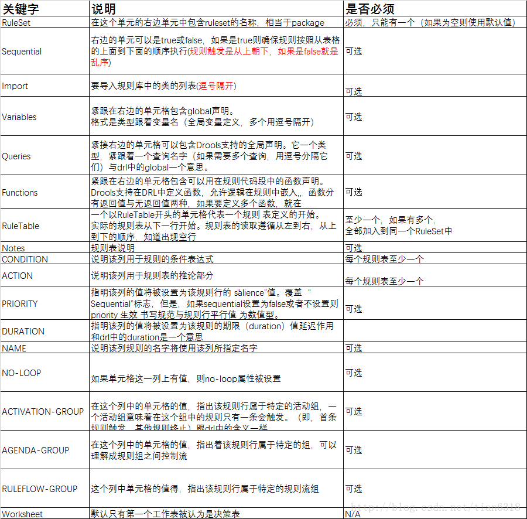

# drools


## 导包

- `maven` 下 `pom.xml` 添加

    ```xml
     <!--drools-->
            <dependency>
                <groupId>org.kie</groupId>
                <artifactId>kie-spring</artifactId>
                <version>${drools.version}</version>
                <exclusions>
                    <exclusion>
                        <groupId>org.springframework</groupId>
                        <artifactId>spring-tx</artifactId>
                    </exclusion>
                    <exclusion>
                        <groupId>org.springframework</groupId>
                        <artifactId>spring-beans</artifactId>
                    </exclusion>
                    <exclusion>
                        <groupId>org.springframework</groupId>
                        <artifactId>spring-core</artifactId>
                    </exclusion>
                    <exclusion>
                        <groupId>org.springframework</groupId>
                        <artifactId>spring-context</artifactId>
                    </exclusion>
                </exclusions>
            </dependency>
            <dependency>
                <groupId>org.drools</groupId>
                <artifactId>drools-compiler</artifactId>
                <version>${drools.version}</version>
            </dependency>
    ```
- 配置开发类 

    如 `cn.danao.conf.DroolsConfig`
    
    
    
- 开发excel需要配置很多内容

    excel关键字内容说明如下图
    
    

    **注意 `excel` 中的变量和导包位置的内容需要使用 `,` 隔开，不要使用 `;`隔开**
    
